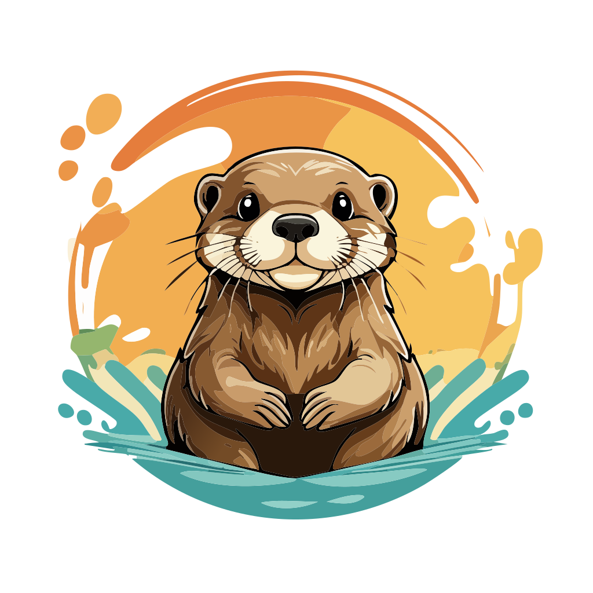

<div style="text-align:center">
    
</div>

# 🦦 Clawless

Clawless is a batteries-included framework that provides everything you need for
production CLIs: structured output, configuration management, environment
context, and scaffolding tools. You write command functions; Clawless provides
the infrastructure.

```rust
use clawless::prelude::*;

#[derive(Debug, Args)]
pub struct GreetArgs {
    /// The name to greet
    #[arg(default_value = "World")]
    name: String,
}

/// Greet the user
#[command]
pub async fn greet(args: GreetArgs, context: Context) -> CommandResult {
    println!("Hello, {}!", args.name);
    Ok(())
}
```

That's it. The function name becomes your command name, doc comments become help
text, and the `Context` parameter gives you access to environment info,
configuration, and output abstractions. Everything you need to build a
professional CLI is already there.

## Quick Start

Install the Clawless CLI:

```bash
cargo install clawless-cli
```

Create a new project:

```bash
clawless new my-cli
cd my-cli
cargo run -- greet
```

Read the [Quick Start guide](https://clawless.rs/docs/quick-start) for a
complete walkthrough.

## Features

- **Convention over configuration** - File hierarchy maps to command hierarchy
- **Type-safe arguments** - Full compiler guarantees via Clap's derive API
- **Async by default** - Tokio runtime managed automatically
- **Context system** - Access environment info and framework features
- **Scaffolding tools** - Generate projects and commands with `clawless new` and
  `clawless generate`
- **Doc-driven help** - Doc comments become help text

## Documentation

- **[clawless.rs](https://clawless.rs)** - Full documentation and guides
- **[docs.rs/clawless](https://docs.rs/clawless)** - API reference
- **[crates.io/crates/clawless](https://crates.io/crates/clawless)** - Published
  crate

## Project Status

Clawless is actively used in our internal projects and continues to evolve based
on real-world needs. The core concepts are stable, but we may add new features
and refine APIs as we expand its capabilities.

If you're building internal tools or prototyping, Clawless is a great choice.
For production applications, review
the [open issues](https://github.com/aonyx-ai/clawless/issues) to understand
current limitations and upcoming features.

## License

Licensed under either of

- Apache License, Version 2.0 ([LICENSE-APACHE](LICENSE-APACHE)
  or <http://www.apache.org/licenses/LICENSE-2.0>)
- MIT license ([LICENSE-MIT](LICENSE-MIT)
  or <http://opensource.org/licenses/MIT>)

at your option.

## Contribution

Unless you explicitly state otherwise, any contribution intentionally submitted
for inclusion in the work by you, as defined in the Apache-2.0 license, shall be
dual licensed as above, without any additional terms or conditions.
