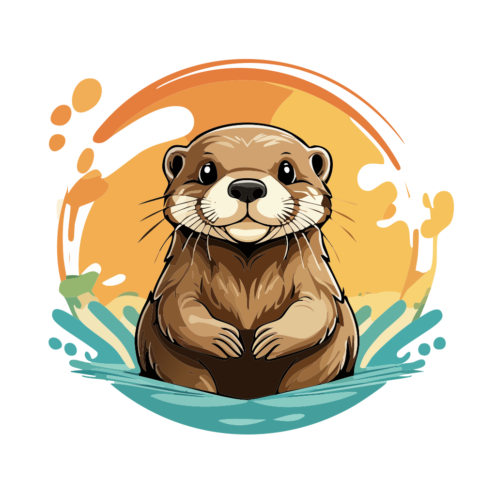

<!-- markdownlint-disable MD033 MD041 -->

<div style="text-align:center">
    
</div>

<!-- markdownlint-enable MD033 MD041 -->

# 🦦 Clawless

Clawless is a batteries-included framework that provides everything you need for
production CLIs: structured output, environment context, graceful cancellation,
and scaffolding tools. You write command functions; Clawless provides the
infrastructure.

```rust
use clawless::prelude::*;

#[derive(Debug, Args)]
pub struct GreetArgs {
    /// The name to greet
    #[arg(default_value = "World")]
    name: String,
}

/// Greet the user
#[command]
pub async fn greet(args: GreetArgs, context: Context) -> CommandResult {
    message!("Hello, {}!", args.name);
    Ok(())
}
```

That's it. The function name becomes your command name, and doc comments become
help text. The `message!` macro sends output through the Clawless output
system. Users can pass `--quiet`, `--verbose`, or `--json` to control the
output of any command, without changes to the command itself.

## Quick Start

Install the scaffolding tool:

```bash
cargo install cargo-clawless
```

Create a new project:

```bash
cargo clawless new my-cli
cd my-cli
cargo run -- greet
```

Read the [Quick Start guide][quick-start] for a complete walkthrough.

## Features

- **Convention over configuration** - File hierarchy maps to command hierarchy
- **Type-safe arguments** - Full compiler guarantees via Clap's derive API
- **Async by default** - Tokio runtime managed automatically
- **Structured output** - `message!`, `detail!`, and `artifact!` render as text
  or JSON, controlled by the `--quiet`, `--verbose`, and `--json` flags
- **Graceful cancellation** - Cooperative shutdown with `Cancellation` tokens
- **Scaffolding tools** - Generate projects and commands with
  `cargo clawless new` and `cargo clawless generate command`
- **Doc-driven help** - Doc comments become help text

## Documentation

- **[clawless.rs][docs]** - Full documentation and guides
- **[docs.rs/clawless][docs-rs]** - API reference
- **[crates.io/crates/clawless][crates-io]** - Published crate

## Project Status

Clawless is actively used in our internal projects and continues to evolve based
on real-world needs. The core concepts are stable, but we will add new features
and refine APIs as we expand its capabilities.

Check out the [roadmap][issues] to see what we're working on and share your
ideas.

If you're building internal tools or prototyping, Clawless is a great choice.
For production applications, review the [open issues][issues] to understand
current limitations and upcoming features.

## License

Licensed under either of

- Apache License, Version 2.0 ([LICENSE-APACHE](LICENSE-APACHE)
  or <http://www.apache.org/licenses/LICENSE-2.0>)
- MIT license ([LICENSE-MIT](LICENSE-MIT)
  or <http://opensource.org/licenses/MIT>)

at your option.

## Contribution

Unless you explicitly state otherwise, any contribution intentionally submitted
for inclusion in the work by you, as defined in the Apache-2.0 license, shall be
dual licensed as above, without any additional terms or conditions.

[crates-io]: https://crates.io/crates/clawless
[docs]: https://clawless.rs
[docs-rs]: https://docs.rs/clawless
[issues]: https://github.com/aonyx-ai/clawless/issues
[quick-start]: https://clawless.rs/docs/quick-start
