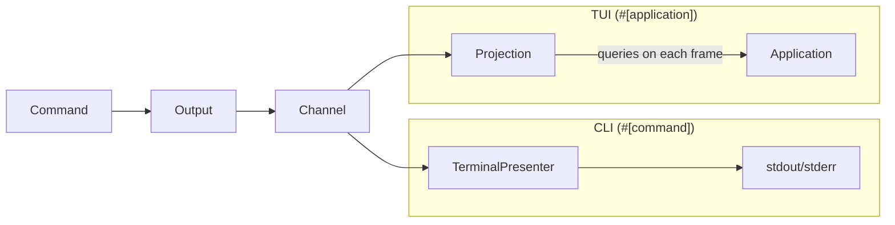

# Rendering

The [output][output] page explains how commands produce output through
`message!`, `detail!`, and `artifact!`. This page explains what happens next —
how that output reaches the terminal.

Clawless uses an event-driven architecture: commands emit structured events into
a channel, and a rendering strategy on the other end consumes them. The choice
of strategy is automatic — `#[command]` functions get push-based terminal
rendering, `#[application]` functions get pull-based projection for TUIs. The
command code is identical in both cases.

## Events

When a command calls `message()`, the [`Output`][output-type] type does not
write to stdout. Instead, it sends a structured event into an async channel.
Events are the universal output type in Clawless — every piece of command output
becomes an event, regardless of how it will eventually be rendered.

There are three event variants, one for each output method:

| Output method | Event variant | Purpose                         |
| ------------- | ------------- | ------------------------------- |
| `message()`   | `Message`     | Informational text for the user |
| `detail()`    | `Detail`      | Verbose-only supplementary text |
| `artifact()`  | `Artifact`    | Primary structured data         |

Events decouple production from rendering. The command decides _what_ to say;
the renderer decides _how_ to say it. This separation is what makes it possible
for the same command code to work in both CLI and TUI contexts without changes.

## The event channel

An async channel connects event producers to consumers. The framework creates
one channel per command or application invocation and wires the two ends
automatically.

The sender side ([`EventSender`][event-sender]) is held by `Output` and is
cheaply clonable, so multiple concurrent tasks within a command can emit events
safely. The receiver side ([`EventReceiver`][event-receiver]) is held by the
rendering strategy — there is exactly one consumer per channel.

The channel is bounded, which provides natural back-pressure when a command
produces events faster than the renderer can consume them. Events are delivered
in send order, and the receiver signals completion once all senders have been
dropped and the buffer is drained.

## Two rendering strategies

Clawless provides two rendering strategies. The framework automatically selects
the right one based on whether the user invoked a [`#[command]`][command-macro]
or an [`#[application]`][application-macro].

The pipeline up to the event channel is identical. Only the consumer differs —
who reads the events and how they reach the user.

## Push-based rendering

For CLI commands, the framework uses [`TerminalPresenter`][terminal-presenter].
It holds the event receiver, reads events one at a time, and writes each to
stdout or stderr immediately. It is stateless: it renders and forgets. This is
the right strategy for CLI commands because their output is linear and
transient — once a message is printed, it scrolls up and is gone.

`TerminalPresenter` applies the verbosity and output mode settings that the
reader already knows from the [output behavior matrix][output]:

- `--quiet` suppresses messages and details
- `--verbose` shows details
- `--json` redirects messages to stderr and serializes artifacts as JSON to
  stdout

[`CommandRunner`][command-runner] wires all of this automatically for
`#[command]` functions. It creates the event channel, wraps the sender in
`Output`, configures a `TerminalPresenter` from the CLI flags, and runs the
command and presenter concurrently.

## Pull-based rendering

For TUI applications, the framework uses [`Projection`][projection]. Instead of
rendering events as they arrive, `Projection` drains the event channel in a
background task and accumulates events as [`Entry`][entry] values. The
application then queries the projection on each render frame to get the current
state.

This is the right strategy for TUI applications because they redraw the entire
screen on each frame and need access to all accumulated output, not just the
latest event.

The key query methods are:

- `entries()` — all accumulated entries in receive order
- `messages()` — message entries only
- `details()` — detail entries only
- `artifacts()` — artifact entries only
- `is_complete()` — whether all senders have been dropped and the channel has
  been fully drained

Query results are cloned snapshots, so the render loop never blocks the
background drain task.

[`ApplicationRunner`][application-runner] wires this for `#[application]`
functions. It creates the event channel, builds the context, creates the
projection inside the Tokio runtime (because the drain task needs to be
spawned), and passes the projection to the application function alongside the
context.

## Commands don't need to know

The same command code works unchanged whether it runs through `CommandRunner` or
is embedded inside a TUI application. A command that calls
`message!("processing")` does not know or care whether that message will be
printed to stdout immediately by a `TerminalPresenter` or accumulated in a
`Projection` for a TUI to query on its next render frame.

The `Output` API is the same. The `Context` is the same. Only the wiring
changes, and the framework handles the wiring.

This is the architectural benefit of the event-driven design: commands are
portable between rendering strategies. A team can start with CLI commands and
later embed them in a TUI dashboard without changing any command code.

## What's next

- **[Output][output]** — the command-facing API for producing output
- **[Macros][macros]** — how `main!()` dispatches to the right runner
- **[Context][context]** — the framework bridge that provides output to commands

[application-macro]: ./macros#application
[application-runner]: https://docs.rs/clawless-tui/latest/clawless_tui/runner/struct.ApplicationRunner.html
[command-macro]: ./macros#command
[command-runner]: https://docs.rs/clawless-cli/latest/clawless_cli/runner/struct.CommandRunner.html
[context]: ./context
[entry]: https://docs.rs/clawless-tui/latest/clawless_tui/projection/enum.Entry.html
[event-receiver]: https://docs.rs/clawless-core/latest/clawless_core/event/struct.EventReceiver.html
[event-sender]: https://docs.rs/clawless-core/latest/clawless_core/event/struct.EventSender.html
[macros]: ./macros
[output]: ./output
[output-type]: https://docs.rs/clawless/latest/clawless/output/struct.Output.html
[projection]: https://docs.rs/clawless-tui/latest/clawless_tui/projection/struct.Projection.html
[terminal-presenter]: https://docs.rs/clawless-cli/latest/clawless_cli/presenter/struct.TerminalPresenter.html
