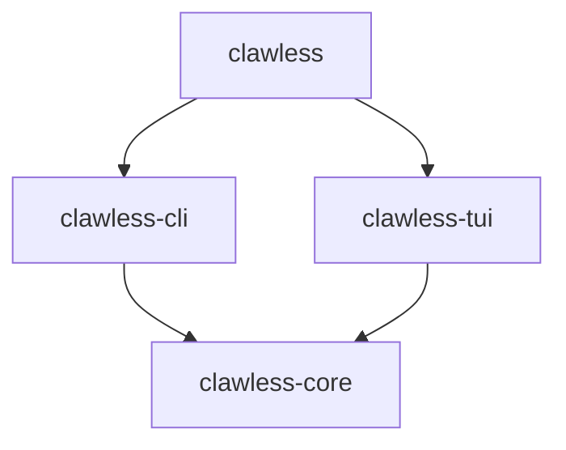

# Clawless Specifications

Clawless is developed using a lightweight spec-driven development workflow. This
directory contains specifications for the different components of Clawless,
written in and verified by [tracey], while this document provides an overview
of the architecture and design principles.

## Domain-Driven Design

Clawless uses [domain-driven design][ddd] to define the vocabulary of a
command-line application framework. Every concept in the system has a precise
name and a clear role. This **ubiquitous language** ensures that humans, LLMs,
and the code itself all use the same terms with the same meanings.

## Hexagonal Architecture

The architecture follows a [hexagonal] (ports and adapters) pattern:

- **Domain core**: the stable concepts that define what a CLI application _is_.
  These do not depend on any particular runtime, terminal, or I/O mechanism.
- **Ports**: interfaces where behavior varies by environment. The domain
  declares _what_ it needs; ports define the contract.
- **Adapters**: concrete implementations that plug into ports. Swappable per
  environment (interactive terminal, CI, testing, scripting).

This separation keeps the domain testable and portable. A command's logic does
not know whether it is running in a color terminal, a CI pipeline, or a test
harness. The same primitives support both one-shot commands that execute and
exit and long-running interactive sessions such as a full-screen TUI.

## Layered Architecture

Clawless is built around a layered architecture with a clear separation of
concerns:

- The `clawless-core` crate defines the domain types and the abstract
  _ports_ that define the behavior of command-line applications.
- The `clawless-cli` crate provides features and adapters for building
  stateless command-line interfaces.
- The `clawless-tui` crate makes it easy to build interactive TUI applications
  based on the `clawless-core` domain model with libraries like [`ratatui`].
- The `clawless` crate re-exports the public APIs of `clawless-core`,
  `clawless-cli`, and `clawless-tui` so that users can import them all at once.

## Event-driven Output

Commands and tasks produce structured output as events, decoupled from how that
output is rendered. The event system is an implementation detail of Clawless,
though, and users do not need to interact with it directly.

This separation supports two rendering strategies:

- **Push-based**: stateless CLIs can render each event as it arrives, printing
  to stdout/stderr and exiting when the command completes.
- **Pull-based**: stateful TUIs can query a view model on each render frame,
  reading accumulated events at their own pace.

The task's code is identical regardless of which strategy is in use.

[ddd]: https://en.wikipedia.org/wiki/Domain-driven_design
[hexagonal]: https://en.wikipedia.org/wiki/Hexagonal_architecture_(software)
[tracey]: https://tracey.bearcove.eu
