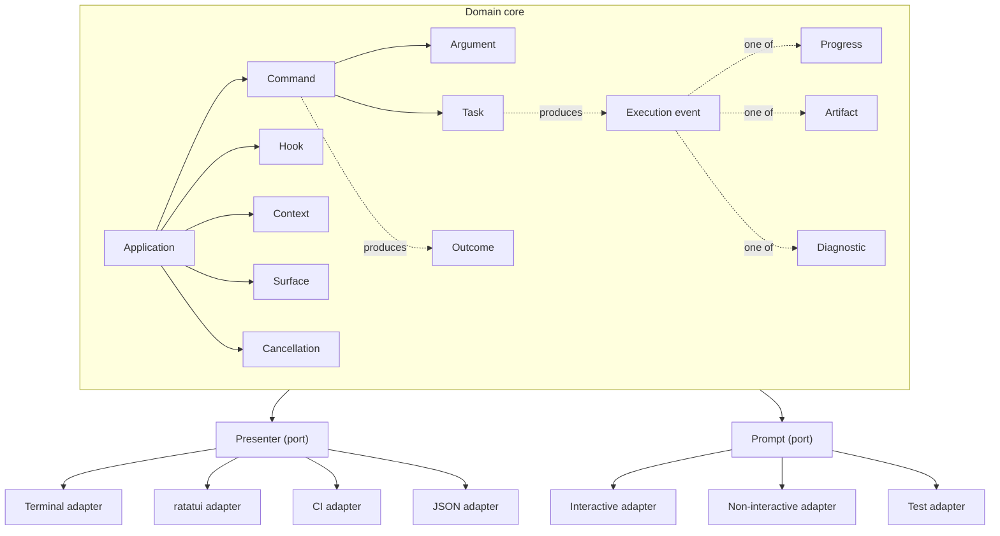
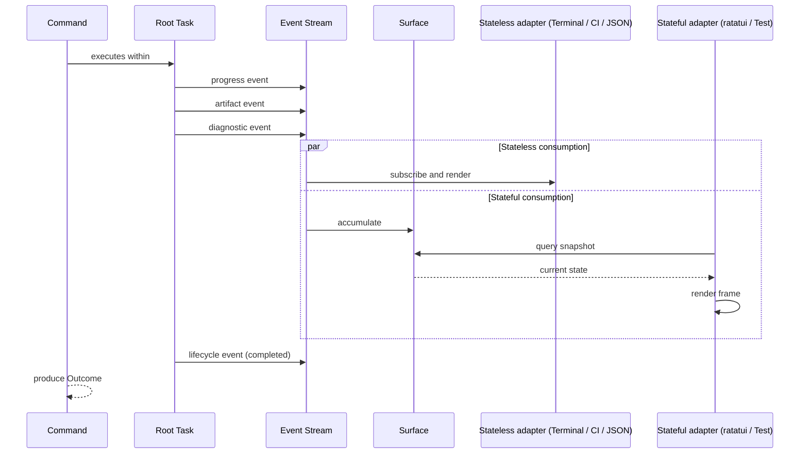
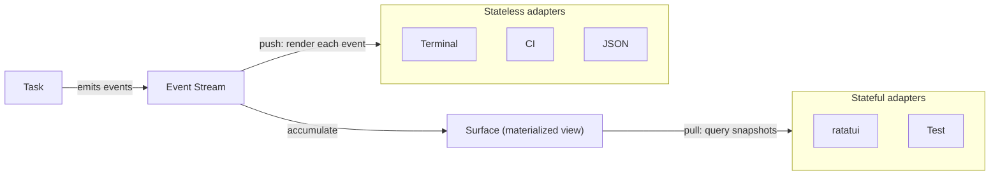
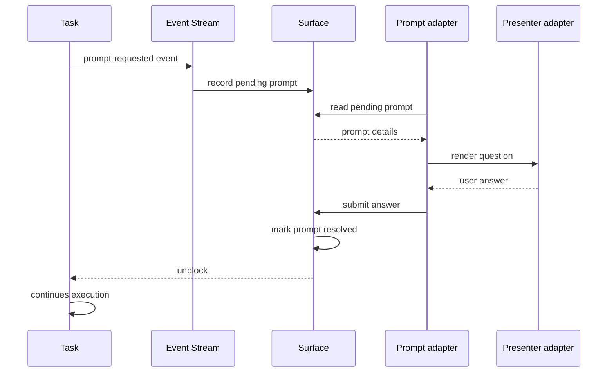

# Architecture

## Introduction

Clawless uses [domain-driven design][ddd] to define the vocabulary of a
command-line application framework. Every concept in the system has a precise
name and a clear role. This **ubiquitous language** ensures that humans, LLMs,
and the code itself all use the same terms with the same meanings.

The architecture follows a [hexagonal][hexagonal] (ports and adapters) pattern:

- **Domain core**: the stable concepts that define what a CLI application _is_.
  These do not depend on any particular runtime, terminal, or I/O mechanism.
- **Ports**: interfaces where behavior varies by environment. The domain
  declares _what_ it needs; ports define the contract.
- **Adapters**: concrete implementations that plug into ports. Swappable per
  environment (interactive terminal, CI, testing, scripting).

This separation keeps the domain testable and portable. A command's logic does
not know whether it is running in a color terminal, a CI pipeline, or a test
harness. The same primitives support both one-shot commands that execute and
exit and long-running interactive sessions such as a full-screen TUI.

[ddd]: https://en.wikipedia.org/wiki/Domain-driven_design
[hexagonal]: https://en.wikipedia.org/wiki/Hexagonal_architecture_(software)

## Architecture overview



Arrows flow outward from the domain through ports to adapters. The domain never
depends on a specific adapter. Adapters depend on the port interface. Within the
domain, tasks emit execution events that flow to the surface, building a
queryable projection of execution state. Presenter adapters consume this state
either by subscribing to the event stream directly (stateless) or by querying
the surface on each render frame (stateful).

## Domain model

Clawless is built around 15 concepts organized into three layers.

### Core entities

Identity matters. These have lifecycles.

| Entity      | Role                                                                                    |
| ----------- | --------------------------------------------------------------------------------------- |
| Application | Aggregate root — owns the command tree, hooks, surface, and context factory             |
| Command     | A node in the command tree; accepts arguments, creates a root task, produces an outcome |
| Argument    | Declarative input parsed from argv before execution                                     |
| Context     | Injected environment: CWD, config, env vars, services, terminal capabilities            |
| Task        | Unit of work within a command; emits execution events, parallelizable, cancellable      |
| Hook        | Cross-cutting lifecycle behavior (ordered pipeline)                                     |
| Surface     | Queryable projection of execution state, built from the execution event stream          |

### Value objects

Identity does not matter. These are data, state, or tokens.

| Value object    | Role                                                                                |
| --------------- | ----------------------------------------------------------------------------------- |
| Execution event | Structured message emitted by a task; carries a payload tagged with source identity |
| Progress        | Ephemeral status update emitted as an execution event payload                       |
| Artifact        | Structured result data emitted as an execution event payload                        |
| Diagnostic      | Rich error/warning info emitted as an execution event payload                       |
| Outcome         | Final result of command execution; maps to exit code                                |
| Cancellation    | Token-based shutdown signal; Tasks observe, framework manages                       |

Cancellation is a value object (a token) in the domain. The mapping from OS
signals to cancellation tokens is infrastructure.

### Ports

Interfaces with swappable adapters. The domain declares intent; the adapter
decides how to fulfill it.

| Port      | Direction | Role                                                                           |
| --------- | --------- | ------------------------------------------------------------------------------ |
| Presenter | Output    | Consumes execution events or queries the surface to render output for the user |
| Prompt    | Input     | Resolves runtime input needs; answers flow back through the surface            |

## Entity definitions

### Application

The aggregate root. Configures the CLI program.

- **Metadata**: name, version, description, author
- **Commands**: the root of the command tree
- **Hooks**: ordered lifecycle pipeline
- **Cancellation**: signal handling, shutdown timeout/cleanup
- **Context factory**: how to build the execution context
- **Surface**: receives execution events, provides queryable execution state
- **Presenter**: the selected Presenter adapter, which consumes events from the
  surface or subscribes directly to the event stream

### Command

A node in the command tree.

- **Identity**: name, aliases
- **Description**: short + long (from doc comments)
- **Arguments**: the typed input this command accepts
- **Children**: subcommands (forming a tree)
- **Behavior**: async function body; optionally spawns Tasks. When a Command
  executes, it does so within an implicit root task. The Command remains the
  routing, parsing, and lifecycle layer; the root task is the execution context
  in which work happens and events originate. A command's behavior may be a
  long-running interactive loop that repeatedly spawns Tasks and solicits
  Prompts. The framework provides the primitives (Task, Prompt, Cancellation)
  that such a loop uses; the session lifecycle is managed by the command itself.
- **Root task**: every command execution creates an implicit root task. Simple
  commands emit events directly from this root task. Complex commands spawn
  child tasks beneath it, forming a tree. The root task ensures that every
  execution event has a source, even when the command author does not explicitly
  create tasks.
- **Presentation agnosticism**: commands are free of presentation concerns.
  They interact with Output to produce messages and results, with Prompt to
  solicit input, and with Task references to manage concurrent work. They never
  touch the terminal, query the surface, or interact with a UI framework
  directly. How output is presented — whether printed line by line, rendered in
  a full-screen TUI, or serialized as JSON — is determined by the Presenter
  adapter, not the command. Each command selects (or inherits) a Presenter; the
  command's code is identical regardless of which Presenter is in use.

### Argument

Declarative, upfront input parsed from argv before execution begins.

Three species:

- **Positional**: ordered, unnamed (`git clone <url>`)
- **Flag**: boolean toggle (`--verbose`, `-v`)
- **Option**: named value (`--output file.txt`)

Properties: name, type, default, required, description, validation, conflicts.

Long-term goal: Clawless-owned abstraction replacing Clap, without writing a
custom parser.

### Context

Injected environment. Everything a command needs that isn't from argv.

Context is read-only. It describes the environment in which a command executes,
not the application's mutable state. Mutable shared state is an
application-level concern; the mechanism for managing it is intentionally
deferred until real usage patterns emerge. Context provides Output for producing
messages and results, and will provide Prompt access for soliciting input. It
does not expose the surface; the surface is the Presenter's API, not the
command's.

- Working directory
- Configuration (hierarchical: global, project, env, flags)
- Environment variables
- Shared services (HTTP client, DB pool, etc.)
- Terminal capabilities (color, width, interactive, piped)

### Task

A unit of work within a command. Opt-in: simple commands run inline without
creating Tasks explicitly, though even inline execution occurs within the
implicit root task.

- **Identity**: every task has a stable identifier and knows its parent, forming
  a tree rooted at the command's root task. This identity is carried on every
  execution event the task emits, enabling consumers to attribute events to
  their source and reconstruct the tree.
- **Lifecycle**: a task progresses through observable states — pending, running,
  completed, failed. Each transition emits a lifecycle event, making the task
  tree's evolution visible to the surface and any consumers downstream.
- **Events**: tasks emit execution events as they work. Progress updates,
  artifacts, diagnostics, and prompt requests all flow as structured events
  tagged with the emitting task's identity. The authoring API is designed to
  feel like direct ownership — a command author calls something like
  `task.artifact(...)` or `task.progress(...)` — but under the hood these calls
  emit events into the event stream. Command authors do not interact with events
  directly; events are an infrastructure concern.
- **Root task**: the implicit task created when a command begins execution. It
  serves as the root of the task tree for that command invocation. Simple
  commands that never explicitly create tasks still emit events from this root.
- **Children**: can spawn sub-tasks, forming a tree. Child tasks inherit their
  parent's cancellation scope by default.
- **Cancellation**: observes cancellation tokens, performs graceful shutdown
  when signaled.

### Hook

Cross-cutting lifecycle behavior. Ordered pipeline.

Lifecycle points:

- `before_parse`: before argv is parsed
- `after_parse`: after arguments are resolved
- `before_execute`: before command runs
- `after_execute`: after command completes (success or failure)
- `on_error`: when a diagnostic is raised

Use cases: logging, auth, `--dry-run`, telemetry, retry.

Registration: attribute-based initially, builder pattern long-term.

### Surface

The surface is the queryable projection of execution state. It accumulates
execution events as they arrive and materializes them into a structured,
read-only view that Presenter adapters and other external consumers can query
at any time. Commands do not interact with the surface; they produce output
through Output and manage tasks through direct task references.

- **Purpose**: bridges the gap between the domain's push-based event model and
  consumers that need to pull current state. Tasks emit events as work happens;
  the surface absorbs those events and maintains a coherent picture of what is
  happening across all tasks. It is the API boundary for Presenter adapters,
  test harnesses, and observability tools — not for commands.
- **State**: tracks the full task tree (parent-child relationships, lifecycle
  states), per-task progress, accumulated artifacts, diagnostics, and pending
  prompt requests. Also provides global aggregate views such as overall progress
  across all tasks.
- **Materialized view**: the surface is not a log or event store. It is a
  materialized view — a live projection that evolves as events arrive. Consumers
  see the current state, not the history of how it got there.
- **Prompt mediation**: serves as the rendezvous point for prompt interactions.
  When a task requests input, the surface records it as a pending prompt. The
  Prompt adapter reads the pending prompt, coordinates with the Presenter to
  display it, and submits the answer back through the surface. The requesting
  task then unblocks and continues.
- **Lifetime**: created by the Application at the start of command execution and
  lives for the duration of that execution. A new surface is created for each
  command invocation.
- **Naming**: the name "Surface" was chosen over alternatives like "Projection"
  because the entity is not purely a read model. A projection implies a
  one-directional derivation from events — consumers read, the projection
  updates. But the surface also mediates prompts bidirectionally: it accepts
  answers from Presenter adapters and delivers them back to waiting tasks. More
  broadly, the surface is the API boundary through which all external
  consumers — Presenter adapters, test harnesses, observability tools —
  interact with execution state. "Projection" describes one aspect (the
  materialized view of events); "Surface" captures the fuller role.

## Value object definitions

### Execution event

An execution event is a structured message emitted by a task during execution.
It is the primary output mechanism of the domain: every piece of information
that flows from a running command to the outside world travels as an execution
event.

- **Source identity**: every event carries the identity of the task that emitted
  it, including its parentage chain. This allows any consumer to attribute the
  event to its source and reconstruct the task tree without additional lookups.
- **Payload**: the event's content. Payload variants include progress (status
  update), artifact (result data), diagnostic (error or warning), prompt
  requested (input needed from the user), and task lifecycle (state transition).
  Each variant corresponds to a domain value object or a lifecycle transition.
- **Timestamp**: when the event was emitted. Enables ordering and time-based
  queries.
- **Immutability**: events are immutable once emitted. They represent facts
  about what happened, not state to be modified.

Command authors do not construct or interact with execution events directly.
The task authoring API — methods like `task.progress(...)` and
`task.artifact(...)` — emits events as an infrastructure concern. This keeps the
authoring experience simple while providing a rich, structured event stream for
consumers.

### Progress

Ephemeral status data emitted by tasks as execution event payloads. Progress is
a **domain value object**: a command updates it ("60% done", "processing
file X"), and it flows as an event to the surface and then to Presenter
adapters. Each progress event is tagged with the identity of the task that
emitted it, so consumers know which task the status belongs to.

- Spinners, progress bars, step indicators, counters
- Multi-task parallel progress display
- Ephemeral: replaced/cleared after task completes
- Emitted as execution event payloads, accumulated by the surface, consumed
  through the Presenter port

### Artifact

Structured result data produced by tasks, emitted as execution event payloads.
Each artifact is tagged with the identity of the task that produced it.

- Typed, serializable (JSON, YAML, table, plain text)
- Machine-readable (for piping, scripting)
- Composable (multiple tasks produce merged artifacts)
- Emitted as execution event payloads, accumulated by the surface, consumed
  through the Presenter port

A task produces artifacts over the course of its execution. They may arrive as
a **stream** — one at a time, as work progresses. The Presenter adapter decides
the strategy: immediate (render each artifact as its event arrives) or batched
(collect and present at the end). Streaming is not a separate concept; it is
simply artifacts produced over time, each as its own event.

### Diagnostic

Rich error/warning information raised by tasks, emitted as execution event
payloads. Each diagnostic is tagged with the identity of the task that raised
it.

- **Message**: what went wrong
- **Cause chain**: underlying errors
- **Context**: what was happening ("while reading config.toml")
- **Suggestion**: what to do ("did you mean --output?")
- **Severity**: fatal, warning, hint
- **Code**: machine-readable identifier
- Emitted as execution event payloads, accumulated by the surface, consumed
  through the Presenter port

### Outcome

Final result of command execution.

- **Exit code**: 0 = success, non-zero = failure
- **Produced by**: Command after Tasks complete
- **Contains**: aggregated Artifacts, any Diagnostics
- Maps to process exit code

### Cancellation

Token-based shutdown signal. Cancellation has a clear domain/infrastructure
split:

- **Domain**: a cancellation token is a value object. Tasks observe it and
  perform graceful shutdown when signaled. Application defines shutdown behavior
  (timeout, cleanup).
- **Infrastructure**: OS signal handling (SIGINT, SIGTERM) creates cancellation
  tokens. This mapping lives outside the domain core.

Cancellation tokens form a tree. The Application owns the root token. A Command
or Task may create a child token scoped to a unit of work (e.g., one REPL turn).
Cancelling a child stops that unit without affecting the parent. Cancelling the
root triggers shutdown of all outstanding work.

Tasks do not know _why_ they were cancelled — only that the token was signaled.

## Port definitions

### Presenter (output port)

The Presenter controls all output. It is the rendering engine in the
architecture: it takes the structured data produced by the domain — either by
subscribing to the execution event stream or by querying the surface — and
presents it to the user.

The port is named "Presenter" because its role is to present domain output to
the user. Commands produce structured output (messages, results, progress,
diagnostics) through presentation-agnostic APIs. The Presenter takes that
structured output and makes it visible — whether by printing lines to a
terminal, rendering a full-screen TUI, serializing JSON, or recording state for
test assertions. Visual formatting decisions — whether to use colors, what kind
of spinner to show, how to lay out a table — are an internal concern of each
Presenter adapter. A Presenter adapter may compose formatters internally to
decide how to render a progress value (as a colored spinner, a bar, or plain
text) or a diagnostic (with context and suggestions, or as a single line). The
domain does not prescribe how output looks, only what output exists.

How a Presenter adapter consumes data depends on whether it implements a
stateless or stateful rendering model.

A **stateless** adapter subscribes to the event stream and renders each event as
it arrives. It does not need to maintain a model of the full execution state
because each event is self-contained and rendered immediately. The terminal and
CI adapters work this way: a progress event updates a spinner, an artifact
prints a result, a diagnostic displays an error message. Events flow through
and are forgotten.

A **stateful** adapter queries the surface on each render frame. It reads the
current task tree, the latest progress for each task, accumulated artifacts,
and pending prompts, then renders a full-screen view. A [ratatui][ratatui]-based
TUI works this way: the render loop runs at its own cadence, independent of
when events were emitted. The surface provides a consistent snapshot for each
frame, and change notifications allow the adapter to avoid busy-polling when
nothing has changed.

The Presenter does not maintain its own tree mirroring the task tree. The
surface maintains the authoritative tree, and stateful adapters read it
directly. Stateless adapters reconstruct what they need from the source identity
carried on each event.

**Interface** (what the domain sees):

- Receives execution events or queries the surface for current state
- Renders progress, artifacts, and diagnostics according to the adapter's
  strategy
- Renders prompt interactions on behalf of the Prompt port
- Manages layout, formatting, and output coordination across concurrent tasks

**Example adapters**:

| Adapter  | Model     | Behavior                                                   |
| -------- | --------- | ---------------------------------------------------------- |
| Terminal | Stateless | Colors, layout, spinners; renders each event as it arrives |
| CI       | Stateless | Plain text, no cursor control, sequential output           |
| JSON     | Stateless | Machine-readable output structured by task                 |
| ratatui  | Stateful  | Full-screen TUI; queries surface on each frame             |
| Test     | Stateful  | Queries surface for assertions; no side effects            |

[ratatui]: https://ratatui.rs

### Prompt (input port)

Prompt is a port, not a domain entity. A command declares "I need this
information" — the Prompt adapter decides how to obtain it.

Prompt interactions flow bidirectionally through the surface. When a task
requests input, it emits a prompt-requested execution event. The surface records
this as a pending prompt. The Prompt adapter reads the pending prompt and
resolves it — in interactive environments by coordinating with the Presenter to
display the question and collect the answer, in non-interactive environments by
resolving programmatically. When an answer is obtained, it is submitted back
through the surface. The requesting task unblocks and continues with the answer.

This mediation through the surface means that domain code for soliciting input
is identical regardless of whether the UI is a line-oriented terminal, a
full-screen TUI, or a test harness.

**Interface** (what the domain sees):

- **What**: a description of the information needed, plus optional structured
  metadata that adapters may use for rendering (e.g., a tool name, arguments,
  and risk level for an approval prompt)
- **Type**: text, confirmation, selection, password
- **Default**: optional fallback value
- **Validation**: constraints on acceptable answers

**Example adapters**:

| Adapter         | Behavior                                                                                                                                           |
| --------------- | -------------------------------------------------------------------------------------------------------------------------------------------------- |
| Interactive     | Reads pending prompts from the surface, renders questions through the Presenter, collects user answers, submits them back through the surface      |
| Non-interactive | Resolves pending prompts programmatically (environment variables, defaults, policy-based auto-resolution); errors if required input is unavailable |
| Test            | Reads pending prompts from the surface, returns preconfigured answers for deterministic testing                                                    |

The domain is not aware of _how_ the answer is obtained. A Prompt for a
database name might be answered by a terminal question, an environment
variable, or a test fixture — the command's logic is identical in all cases.

## Event model

The execution event stream is the backbone of Clawless's output architecture.
Rather than having tasks push data directly to a Presenter adapter, every piece
of output flows as a structured event. This indirection is what makes the
architecture portable across rendering models.

Events decouple producers from consumers. A task emitting a progress update does
not know — and does not need to know — whether that update will drive a terminal
spinner, update a progress bar in a TUI, be recorded for a test assertion, or
be ignored entirely. The task emits the event; the infrastructure routes it.

Every event carries the identity of the task that emitted it, including enough
parentage information to reconstruct the task tree. This source tagging is what
allows the surface to attribute state to the correct task and what allows
stateless adapters to associate output with its origin without maintaining their
own bookkeeping.

Events use push semantics: they are emitted as work happens, with no buffering
required at the bus level. A stateless consumer can process events in the order
they arrive and discard them. A stateful consumer (the surface) accumulates them
into a live projection. The bus itself is a delivery mechanism, not a store.

The authoring experience is deliberately insulated from the event model. Command
authors work with task methods — requesting progress updates, producing
artifacts, raising diagnostics — and the framework translates those calls into
events. This keeps the authoring API ergonomic and focused on domain concerns
while giving the infrastructure a uniform, structured stream to work with.



## Surface model

The surface is the API boundary for external consumers of execution state
(Presenter adapters, test harnesses, observability tools). It sits
between the domain's event-driven output and the variety of consumers that need
to understand what is happening during execution. This section explains why the
surface exists, how it works, and what it enables.

### Push and pull

The domain produces output by **push**: tasks emit execution events as work
happens, at whatever pace and in whatever order the work dictates. This is the
natural model for a concurrent system where multiple tasks run in parallel and
produce output independently.

Some consumers match this model well. A terminal adapter that prints each line
as it arrives is a natural fit for push: events flow through and are rendered
immediately. But stateful UIs do not work this way. A full-screen TUI redraws
on a fixed cadence — say, 60 frames per second — and needs to know the
_current state_ of all tasks at the moment of each frame. It cannot process a
stream of events inline; it needs to **pull** a snapshot.

The surface bridges this mismatch. It subscribes to the event stream, absorbs
every event, and maintains a live, queryable projection of execution state. Push
consumers can subscribe to the same event stream directly. Pull consumers query
the surface. The domain does not need to know which consumption model is in use.



### Stateless rendering

For stateless rendering environments — a terminal printing to stdout, a CI log,
a JSON stream — the surface may be minimal or even absent. Events flow from
tasks through the event stream directly to the Presenter adapter, which renders
each one as it arrives. A progress event updates a spinner in place. An artifact
prints a result line. A diagnostic displays an error with context and
suggestions.

This is the simpler path and the one most CLI applications need. The event
stream provides structure (source tagging, typed payloads) without requiring the
overhead of maintaining full execution state. The adapter processes each event
and moves on.

### Stateful rendering

For stateful rendering environments — a [ratatui][ratatui] TUI, a web
dashboard, a graphical IDE panel — the surface is essential. The render loop
runs at its own cadence, independent of when events are emitted. On each frame,
the adapter queries the surface for the current state: the task tree, each
task's lifecycle state and latest progress, accumulated artifacts, pending
diagnostics, and any outstanding prompt requests.

The surface provides a consistent snapshot for each query, so the adapter never
sees a half-updated state. Change notifications allow the adapter to skip
rendering when nothing has changed, avoiding the cost of busy-polling.

A ratatui adapter, for example, might render the task tree as a nested list in
one panel, show progress bars for each running task in another, display
artifacts as they accumulate in a scrollable output region, and present pending
prompts in a focused input widget. All of this state comes from the surface, and
the adapter never subscribes to the raw event stream.

### Prompt mediation

The surface serves as the rendezvous point for all prompt interactions,
regardless of the rendering model. The flow is the same in every environment:

1. A task needs input and emits a prompt-requested event.
2. The surface records the request as a pending prompt.
3. The Prompt adapter — whether interactive, non-interactive, or test — reads
   the pending prompt from the surface.
4. The adapter obtains an answer (by coordinating with the Presenter to ask
   the user, reading an environment variable, or returning a preconfigured
   test value).
5. The adapter submits the answer back through the surface.
6. The requesting task unblocks and continues.



Because both the request and the answer flow through the surface, the domain
code that solicits input is identical regardless of the rendering model. A
command that prompts for confirmation works the same way whether the user is
interacting through a simple terminal prompt or a TUI dialog.

### Per-command presenter selection

Each command in a CLI can have a different Presenter adapter. A `list` command
might use the default terminal Presenter — events flow to the adapter, lines
print to stdout, the command exits. A `dashboard` command might use a ratatui
Presenter — the adapter owns the render loop, queries the surface each frame,
and presents a full-screen TUI.

The command's code is the same in both cases. Both commands use Output to
produce messages and results, Task references to manage work, and Prompt to
solicit input. The difference is which Presenter adapter processes the resulting
events and surface state. The command does not know or care how its output is
rendered.

This means a single CLI can host both simple, stateless commands and rich,
interactive commands. The domain model, lifecycle, and authoring APIs are
shared. Only the Presenter adapter varies.

### Beyond rendering

The surface's value extends beyond visual rendering. Because it provides a
structured, queryable view of execution state, it enables several patterns that
would be difficult to achieve with a raw event stream alone.

**Testing**: assertions can be written against the surface's structured state
rather than parsing rendered output. A test can verify that a specific task
produced a specific artifact, that progress reached 100%, or that a diagnostic
was raised with the expected severity — all without depending on a particular
rendering format.

**Observability**: the surface could be exposed over a network interface,
allowing external tools to monitor execution state in real time. A build
dashboard, a remote debugging tool, or a process supervisor could all query the
same structured state.

**Composition**: one process could read another's surface, enabling tool
composition where a parent process monitors and reacts to the execution state of
child processes.

**Replay and debugging**: because the surface is built from events, it can be
rebuilt from a recorded event stream. This enables post-hoc debugging: replay
the events, query the surface at any point, and understand what the execution
state looked like at that moment.

## Relationships

```text
Application
├── Commands (tree)
│   ├── Arguments (per command)
│   └── Behavior → executes within root task, optionally spawns child tasks
├── Hooks (lifecycle pipeline)
├── Cancellation (framework-level, propagated to tasks)
├── Context (built once, injected into commands)
├── Surface (receives execution events, provides queryable state)
└── Presenter adapter (consumes events or queries surface)
```

See the data flow diagram in "Event model" and the prompt interaction diagram in
"Surface model" for how data crosses these boundaries. Arrows that cross the port
boundary are the seams where adapters are swapped.

## Lifecycle

```text
 1. Application starts
 2. Surface is created
 3. Context is built (CWD, config, env, terminal capabilities)
 4. Hooks::before_parse()
 5. Arguments parsed from argv
 6. Hooks::after_parse(args)
 7. Command resolved (routing through tree)
 8. Hooks::before_execute(command, args, context)
 9. Command executes within its root task
    - Root task is created implicitly; all events have a source
    - Optionally spawns child tasks (or emits directly for simple commands)
    - Tasks emit execution events → surface accumulates state
    - Progress events → surface updates → Presenter adapter renders
    - Artifact events → surface accumulates → Presenter adapter renders
    - Diagnostic events → surface records → Presenter adapter renders
    - Prompt events → surface records pending → Prompt adapter resolves
    - Tasks observe Cancellation → graceful shutdown
10. Command produces Outcome
11. Hooks::after_execute(outcome)
12. Hooks::on_error(diagnostic)  [if applicable]
13. Application exits with Outcome's exit code
```

Step 9's emissions all flow through the event stream and surface. The command
does not interact with the terminal, the CI system, or the test harness
directly.

For stateful, interactive commands — such as a TUI-based session — step 9
becomes a long-running loop. The command repeatedly spawns tasks, produces
output, and solicits prompts through the same presentation-agnostic APIs as any
other command. The Presenter adapter — in this case a stateful one like
ratatui — queries the surface on each frame to render a live view of execution
state. Steps 10 through 13 occur when the session ends, either by user action
or cancellation.

## Current state

| Entity          | Current implementation                       | Status                                 |
| --------------- | -------------------------------------------- | -------------------------------------- |
| Application     | `main!()` macro                              | Implicit, no first-class type          |
| Command         | `#[command]` async fn                        | Emergent from fn + attrs + module      |
| Argument        | Clap `#[derive(Args)]`                       | Fully delegated to Clap                |
| Context         | `Context` struct (CWD, Cancellation, Output) | Functional                             |
| Prompt          | Not represented                              | Missing                                |
| Hook            | Not represented                              | Missing                                |
| Task            | Not represented                              | Missing; commands are monolithic       |
| Surface         | Not represented                              | New concept, not yet implemented       |
| Execution event | Not represented                              | New concept, not yet implemented       |
| Cancellation    | `Cancellation` value object + signal adapter | Fully implemented                      |
| Progress        | `Output::print()`, `Output::verbose()`       | Partial; no progress bars or spinners  |
| Artifact        | `Output::result()` (`Display` + `Serialize`) | Partial; single value per command      |
| Diagnostic      | `anyhow::Result`                             | Exists but unstructured                |
| Outcome         | `CommandResult` = `anyhow::Result<()>`       | Thin alias, no exit code control       |
| Presenter       | `Output` with `Verbosity` and `OutputMode`   | Partial; stateless text and JSON modes |

The current `Output` type is an early stateless implementation that predates the
event model. It writes directly to stdout and stderr without an intermediate
event stream or surface. As the architecture evolves, Output will remain the
command-facing API for producing output, but its implementation will route
through the event stream and surface to the Presenter port.

## Open questions

### Stdin placement

Piped data (`echo "input" | mycli process`) is fundamentally different from
interactive prompts. It does not fit under the Prompt port: piped data is a
byte stream available at startup, not a question-and-answer interaction during
execution.

Options:

- **Part of Context**: stdin as an input stream available in the execution
  environment, alongside CWD and config.
- **Separate Input port**: a dedicated port for reading streaming input, with
  adapters for pipes, files, and test fixtures.
- **Something else**: an approach not yet considered.

### Output ergonomics

Should simple commands still be able to call `println!`, or must all output
flow through Output?

Output is the command-facing API; the Presenter port is behind it. A strict
"everything through Output" rule ensures consistent rendering and Presenter
agnosticism, but adds ceremony for commands that just want to print a line.
Output's current design — simple methods like `print()` and `result()` — aims
to keep this ceremony minimal, but the right balance between strictness and
convenience remains open.

### Surface ownership and concurrency model

The surface must be safe to write to (from the event stream) and read from (by
Presenter adapters) concurrently. The ownership model — whether the surface is
behind a lock, uses lock-free data structures, or communicates through
channels — affects both performance and ergonomics. The right choice likely
depends on the expected event throughput and the number of concurrent readers.

### Event bus implementation

The mechanism for delivering events from tasks to the surface (and optionally to
stateless adapters directly) needs to be chosen. Options include bounded
channels, unbounded channels, and broadcast channels. Back-pressure policy
matters: should a slow consumer cause producers to block, or should events be
dropped? For most CLI applications the volume is low enough that this is
unlikely to matter, but the design should account for high-throughput scenarios
like build systems with many parallel tasks.

### Surface change notification

Stateful adapters need to know when the surface has changed so they can
re-render. Polling on every frame is wasteful when nothing has happened. A
notification mechanism — a condition variable, a watch channel, or a dirty
flag — would let adapters sleep until new events arrive. The right choice
depends on the concurrency model chosen for the surface.

### Root task visibility to command authors

The root task is created implicitly, but command authors may want to emit events
from it directly (e.g., progress on a simple command that does not spawn child
tasks). The question is whether the root task should be explicitly accessible
through the authoring API, or whether convenience methods on the command context
should route to it transparently. Explicit access is more flexible; implicit
routing is more ergonomic.
